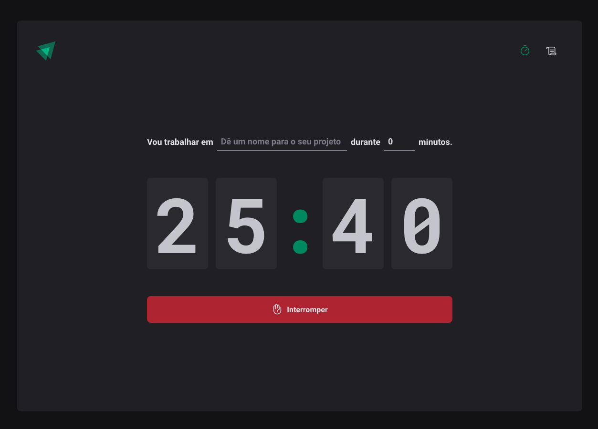
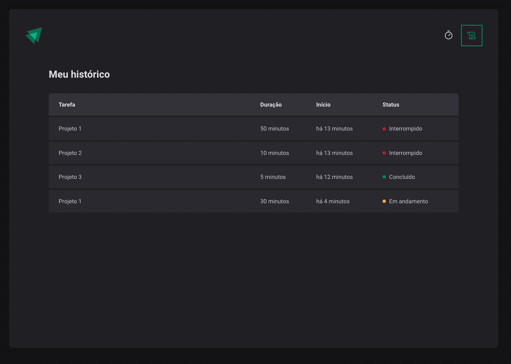

<h1 align="center">
  </img>
</h1>

<p align="center">
  <a href="#ℹ-description">Description</a> •
  <a href="#-demo">Demo</a> •
  <a href="#-technologies">Technologies</a> •
  <a href="#-how-to-use">How to use</a>
</p>

<p align="center">
  </img>
</p>

## ℹ Description

> This is **pomodoro** application with some new nice features made with ReactJS, TypeScript, Styled Components, React Hook Form, Zod and much more.

The application has the following features:

- Add a new cycle
- Save cycle in a list
- Show history of cycles and their status
- Show timer as the cycle goes
- Maintain cycles on Local Storage

All using good clean code practices in ReactJS with TypeScript and relevant libraries.

## 💻 Demo

<p align="center"><p>

### Screenshots

<!--  -->

<center>
  
</center>

<center>
   
</center>


## 🛠 Technologies

### Frontend

- [**React**](https://reactjs.org/)
- [**React Router Dom**](https://www.npmjs.com/package/react-router-dom)
- [**Styled Components**](https://styled-components.com/)
- [**Hook Form**](https://react-hook-form.com/)
- [**Zod**](https://github.com/colinhacks/zod)
- [**Date Fns**](https://date-fns.org/)
- [**Immer**](https://github.com/immerjs/immer)
- [**Phosphor React**](https://phosphoricons.com/)
- [**Vite**](https://vitejs.dev/)

_Others requirements can be seen on the package.json file_

## 🖥 How to use

```bash
# clone this repo and access its folder
$ git clone https://github.com/andrevks/ignite-timer && ignite-timer

# Initiate frontend
$ npm install
$ npm run dev 
```

---

<p align="center">Made with 💜 by <a href="https://github.com/andrevks">André Geraldo</a></p>
